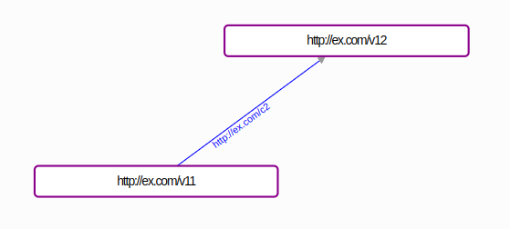
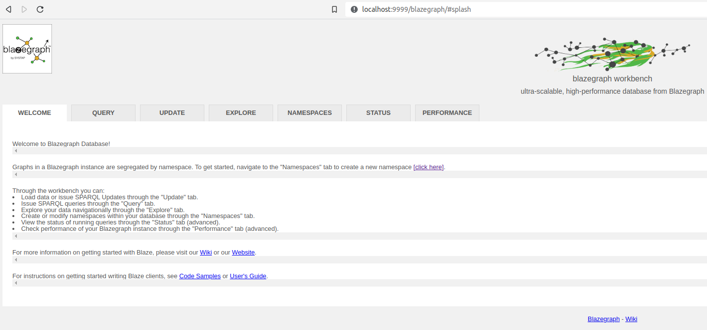

# Ejercicio transformación de datos CSV a RDF

## Introducción

El objetivo de este ejercicio es transformar unos datos inventados, en formato CSV, a un grafo de conocimiento RDF, para familiarizarse con el proceso y entender el modelo de datos. A coninuación se muestra un primer ejemplo muy abstracto (Proceso general) con diferentes métodos que se pueden usar para transformar los datos a RDF, siendo el método manual el más recomendado para entender bien el modelo de datos RDF. Después se ofrecen los ejercicios propiamente dichos (Ejercicio 1, ...) que exploran diferentes áreas del modelado de datos en RDF y su tecnología, de más fácil a más difícil.

## Proceso general

Supongamos el siguiente CSV con las columnas "c1", "c2" y "c3" y dos líneas de valores:

```csv
c1,c2,c3
v11,v12,v13
v21,v22,v23
```

Para traducirlo a RDF debemos crear un archivo en texto plano que contenga los mismos datos, pero en forma de grafo en vez de en forma de tabla. Nuestro grafo puede tener cualquier topología que nos parezca buena, simplemente se trata de crear tripletas sujeto-predicado-objeto con los datos, dando a cada entidad una URI para identificarla (`<>`):

```nt
<http://ex.com/v11> <http://ex.com/c2> <http://ex.com/v12> .
```

Ya tenemos nuestra primera tripleta. Si copiamos y pegamos ese texto en https://issemantic.net/rdf-visualizer veremos su representación gráfica:



Lo elementos de esa tripleta son:

* `http://ex.com/v11` (Sujeto): la entidad que estamos describiendo (Por ejemplo "Bilbo Data Lab").
* `http://ex.com/c2` (Predicado): una propiedad de esa entidad (Por ejemplo "parte de").
* `http://ex.com/v12` (Objeto): el valor de esa propiedad para esa entidad (Por ejemplo "Wikitoki").

El archivo que acabamos de crear sigue una sintaxis concreta, en este caso [NTriples](https://www.w3.org/TR/n-triples/), que consiste en poner una tripleta por linea acabando en punto. Hay muchas sintaxis disponibles (xml/rdf, ttl, nq, nt, json-ld, ...) pero es importante acordarse de que usemos la sintaxis que usemos, el grafo es el mismo.

Podemos subir el archivo a la Triple Store Blazegraph y así hacer consultas sobre el grafo, publicarlo etc. Para ello lo primero es ejecutar Blazegraph con Java:

```bash
java -server -Xmx4g -jar blazegraph.jar
```

Si vamos a `localhost:9999` deberíamos ver:



Si vamos a la pestaña `UPDATE` podemos subir el archivo (`Choose file`;`Update`). Después, para comprobar que los datos se han subido correctamente, en la pestaña `QUERY` podemos ejecutar la siguiente consulta SPARQL:

```sparql
SELECT *
WHERE {
  ?s ?p ?o
}
```

Y debería devolver los mismos datos.

### Manual (Recomendado)

El método manual es el mismo que el del ejemplo. Sólo sirve para conjuntos pequeños de datos pero es con el que más se aprende. Para los que usen VS Code, existe una [extensión muy útil]((https://marketplace.visualstudio.com/items?itemName=Elsevier.linked-data)).

### Con Python (Opcional)

Escribir un pequeño programa que haga la transformación es un método muy flexible y fácil de mantener y reutilizar. Existen librerías para Python (RDFLib), Java (RDF4J), Javascript (RDFJS), ...

Hay un ejemplo con Python y RDFLib en este mismo repositorio: `RegistroLicitadoresYEmpresasClasificadas/CSV2RDF.py`.

### Con herramientas declarativas (Opcional)

Existen herramientas en las que se pueden declarar las reglas para transformar datos a RDF, y un programa interpreta las reglas y las ejecuta. Es un método parecido al anterior, pero en proyectos grandes es mejor usarlo ya que el código es más fácil de entender y mantener, aunque tienen cierta curva de aprendizaje. Algunos ejemplos:

* [YARRRML](https://rml.io/yarrrml/) (Se usa como base para los servicios de [Google de reconciliación](https://cloud.google.com/enterprise-knowledge-graph/docs/entity-reconciliation-console)).
* [Morph-KGC](https://github.com/morph-kgc/morph-kgc).

### Con herramientas gráficas (Opcional)

Las herramientas gráficas son las más fáciles de usar, pero en grandes proyectos no son útiles. Algunos ejemplos:

* [Open Refine](https://openrefine.org/) con [extensión RDF](https://github.com/AtesComp/rdf-transform). Open Refine ofrece un servicio de [Reconciliacion](https://openrefine.org/docs/manual/reconciling).
* [OntoRefine](https://graphdb.ontotext.com/documentation/9.5/standard/loading-data-using-ontorefine.html).

## Ejercicio 1

Convierte los datos del arhivo CSV `ej1.csv` a RDF siguiendo el método manual.

## Ejercicio 2

Aunque te puedes inventar todas la relaciones en los predicados, conviene usar algunas más estándares, para aumentar la interoperabilidad. Repasa el ejercicio 1 inténtando usar las siguiente relaciones (Primero tendrás que buscar información sobre ellas y entender qué significan):

* http://www.w3.org/1999/02/22-rdf-syntax-ns#type (rdf:type). PISTA: mira las bolas naranjas de la transparencia 16.
* http://www.w3.org/2000/01/rdf-schema#label (rdfs:label). PISTA: aunque las entidades se identifican con URIs, también tienen nombres en diferentes idiomas.
* Cualquier relación que encuentres en el servicio [LOV](https://lov.linkeddata.es/dataset/lov) que te parezca adecuada.
* Relaciones de [Schema](https://schema.org/).

También conviene usar entidades de otros grafos en la posición del objeto de la tripleta, creando así enlaces que mejoran el descubrimiento de datos nuevos. ¿Cómo añadirías el concepto "Bilbo" de [Wikidata](https://www.wikidata.org/) en tu grafo?

## Ejercicio 3

Añade los datos del archivo `ej3.csv` al grafo, de tal manera que los datos de ambos CSVs queden integrados en un solo grafo.

## Ejercicio 4

Añade los datos del archivo `ej4.csv` al grafo, de tal manera que los datos de los tres CSVs queden integrados en un solo grafo.

## Ejercicio 5

Haz una consulta SPARQL contra Blazegraph que te devuelva todos los datos sobre mikel.

Haz una consulta SPARQL contra Blazegraph que te devuelva las personas que trabajan como profesor y viven en cordoba.

## Ejercicio 6

Haz una consulta SPARQL que combine los datos de tu grafo con los que contiene Wikidata sobre Bilbo (PISTA: "SERVICE").

## Ejercicio 7

La sintaxis [NQ](https://www.w3.org/TR/n-quads/) se usa para codificar [Named Graphs](https://www.oxfordsemantic.tech/fundamentals/what-is-a-named-graph). ¿Como codificarías los datos de los tres CSVs en tres named graphs (PISTA: aparte de usar NQ, en Blazegraph hay que crear un "namespace" nuevo, con la opción "quads" activada, y ponerlo en uso ("use"))?¿Qué significa usar Named Graphs con respecto a la integración de datos?

## Ejercicio 8

Puedes usar el archivo `docker-compose.yml` como guía para crear un servidor Linked Data que se conecte a Blazegraph y  publique los datos via web.